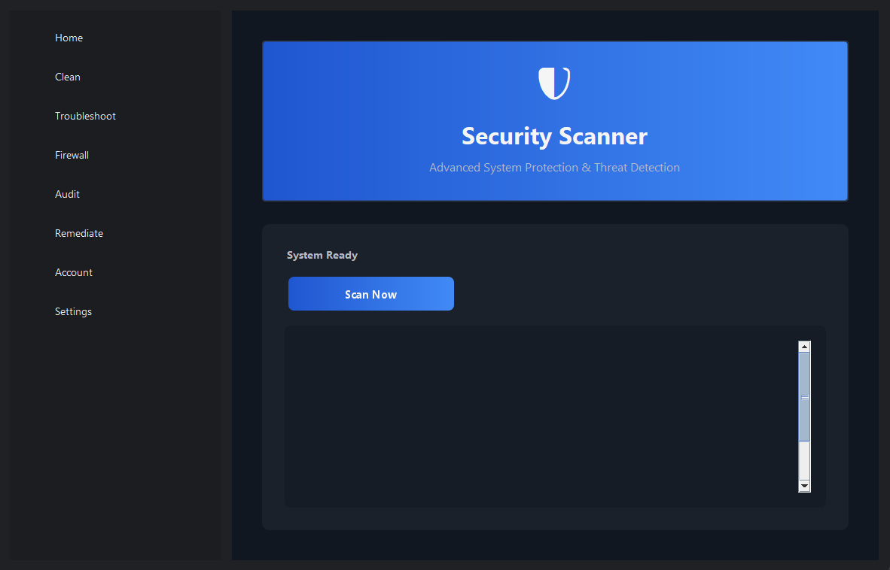
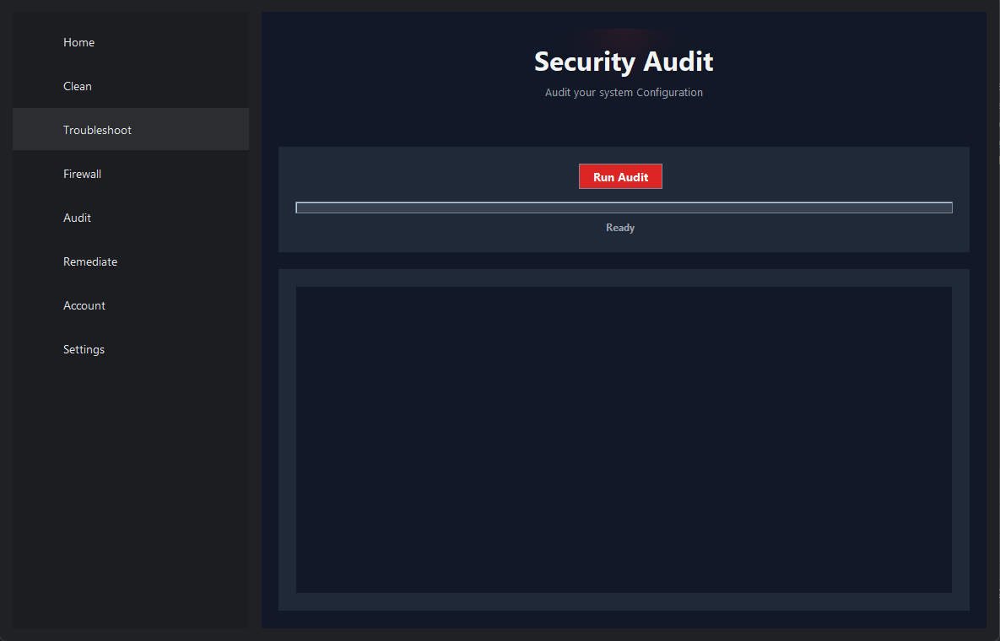
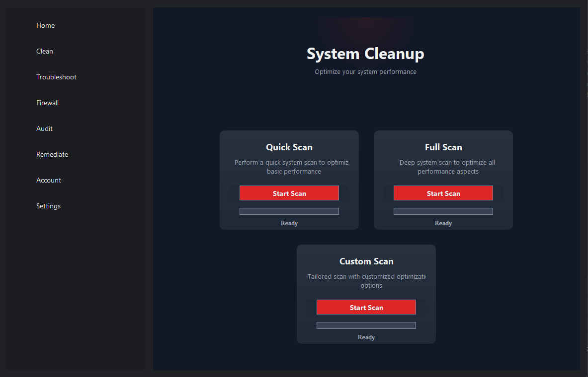

# Swing App

A modern, feature-rich security dashboard application built with Java Swing and Python, offering comprehensive system security management and monitoring capabilities.



##  Features

- **Modern UI Design**: Clean and intuitive interface with dark mode theme
- **Security Monitoring**: Real-time system security status monitoring
- **System Cleaning**: Advanced system cleanup capabilities
- **Troubleshooting Tools**: Built-in diagnostic and problem-solving utilities
- **Firewall Management**: Integrated firewall control and configuration
- **Security Auditing**: System security audit and reporting
- **Remediation Tools**: Automated security issue remediation
- **Account Management**: User account security settings and controls

##  Installation

### Prerequisites
- Java JDK 11 or higher
- Python 3.8 or higher
- Git

### Clone the Repository
```bash
git clone https://github.com/Ankits39229/swingapp.git
cd swingapp
```

### Build and Run(Terminal/Bash)
1. Compile Java files:
```bash
javac -d bin src/*.java
```

2. Run the application:
```bash
java -cp bin Main
```

### Build and Run(IDE)
1. Open Project(GUI):
```
Open an IDE of your choice (IntelliJ/Eclipse is a better option).
Then Open folder and locate to the Swing App.
```
3. Open Project(Terminal):
```
In the IDE open up a terminal and got to a desired folder and clone the repository.
```
```
git clone https://github.com/Ankits39229/swingapp.git
```

##   Project Structure

```
Swingapp/
├── src/
│   ├── java/
│       ├── Main.java
│       ├── Home.java
│       ├── Clean.java
│       ├── Troubleshoot.java
│       ├── Firewall.java
│       ├── Audit.java
│       ├── Remediate.java
│       ├── Account.java
│       └── Settings.java
├── appScripts
|       ├── troubleshoot/
|       |   ├── temp.py
│       └── [Python scripts]
└── README.md
```

##  Screenshots

### Home Dashboard


### Auditing


### System Cleaning


##  UI Components

- **Color Scheme**:
  - Background: Dark theme (#202124)
  - Accent: Modern blue (#8AB4F8)
  - Text: Soft white (#E8EAED)
  - Secondary elements: Muted gray (#9AA0A6)

- **Features**:
  - Responsive layout
  - Card-based components
  - Smooth animations
  - Shadow effects
  - Hover interactions

##  Contributing

1. Fork the repository
2. Create your feature branch (`git checkout -b feature/AmazingFeature`)
3. Commit your changes (`git commit -m 'Add some AmazingFeature'`)
4. Push to the branch (`git push origin feature/AmazingFeature`)
5. Open a Pull Request

##  License

## Contact

Ankit - ankits39229@gmail.com

Project Link: [https://github.com/Ankits39229/swingapp.git](https://github.com/Ankits39229/swingapp.git)

---
⭐️ Star this repo if you find it helpful!
